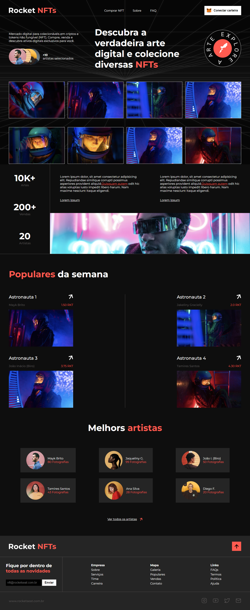

# Rocket NFTs Page

NFTs have gone viral nowadays, since some very famous people started down deep on this market. This repo is another challenge provided by rocketseat on the discover trail. It is a home-page of a plataform of NFTs market.

## Screenshot

<h3 align="center">
  
</h3>

## About the project

The challenge was follow the design and care about the semantics of the project. Right now, the project is not responsive, the reason why it is not responsive is because they don't provided any mobile design on somenthing else.
  
I tried to use SMACSS for the very first time in the project, i liked so much, it's organized and ease maintence.
  
I also included some lazy loading and animation features, to make it more enjoyable for the client (changed to lib scrollreveal).

## Stack used

**Front-end**: Semantic HTML, CSS (SMACSS, SASS), Javascript

## License

[MIT](https://choosealicense.com/licenses/mit/)
